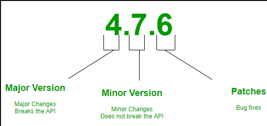

# Semantic Versioning(Manual)
This is a versioning system for software that uses a three-part version number: MAJOR.MINOR.PATCH. Each part of the version number has a specific meaning:



- MAJOR: Incremented for backward incompatible changes.
- MINOR: Incremented for adding featured.
- PATCH: Incremented for backward-compatible bug fixes and minor changes.

Semantic Versioning helps developers and users understand the impact of changes in new software releases. For more details, you can refer to the Semantic Versioning specification.

## Versioning steps:

### 1. Create repository
Create a new repository on your preferred Git provider (e.g., GitHub, Bitbucket, GitLab). Ensure that the repository includes a `changelog.md` file. This file will be used to record all changes made to the project over time, providing a clear history of what has been modified, added, or fixed in each version. The `changelog.md` file is essential for maintaining transparency and keeping track of the project's evolution.

### 2. Create issues
Based on your project tasks, create issues on GitHub. For each issue, you will create a corresponding branch. Once you have completed the work on an issue, merge the branch back into the `developer` branch.

Branches should follow this naming format:
- **Change type**: The type of change (e.g., `feat`, `fix`, `chore`, `docs`, `style`, `refactor`, `perf`, `test`).
- **Branch name**: Should rhyme with the issue title and include the issue number.

For example, if you have an issue titled "Add user authentication" with issue number `#1`, you might create a branch named `feat/#1-add-user-authentication`.

Steps:
1. Create an issue on GitHub.
2. Create a branch following the format: `change-type/#issue-number-branch-name`.
    ```
    git checkout -b 'feat/#1-add-user-authentication'
    ```
3. Work on the issue in the branch.
4. Once done, merge the branch into the `dev` branch.

### 3. Complete the sprint and create a pull request
Once the sprint is complete, follow these steps to merge your changes into the main branch (e.g., `master`):

1. **Update the [`changelog.md`](./changelog.md) file**: Record all changes made during the sprint. Use the following format for each entry:
    - **Added**: For new features.
    - **Changed**: For changes in existing functionality.
    - **Deprecated**: For soon-to-be removed features.
    - **Removed**: For now removed features.
    - **Fixed**: For any bug fixes.
    - **Security**: In case of vulnerabilities.

    Each entry should include the branch number and a link to the pull request. Example `changelog.md` entry:
    ```markdown
    ## [1.0.1] - 2023-10-10
    ### Added
    - Added user authentication feature ([#1](http://github.com/pull-request/1)).

    ### Fixed
    - Fixed issue with login timeout ([#2](http://github.com/pull-request/2)).
    ```

2. **Commit the changes**: When in the `dev` branch, commit the changes to the [changelog.md](./changelog.md) file. The commit message should include the version number.
    ```sh
    git add changelog.md
    git commit -m 'chore: v1.0.1'
    ```

3. **Create the pull request**: On your Git provider, create a pull request from the `dev` branch to the main branch (e.g., `master`). Once the pull request is approved, merge it.

### 4. Create a tag for the new version
After merging the `dev` branch into the main branch (e.g., `master`), create a tag that points to the new version commit. This helps in tracking releases and makes it easier to reference specific versions.

#### Using Git commands:
1. **Create a tag locally**: Use the following command to create a tag for the new version.
    ```sh
    git tag -a v1.0.1 -m "Release version 1.0.1"
    ```

2. **Push the tag to the remote repository**: Push the tag to your remote repository to make it available on GitHub.
    ```sh
    git push origin v1.0.1
    ```

3. **Verify the tag on GitHub**: Go to your repository on GitHub, navigate to the "Tags" section under "Releases" to verify that the new tag has been created and points to the correct commit.

#### Using GitHub UI:
1. **Go to your repository on GitHub**.
2. **Click on the "Releases" tab**.
3. **Click on the "Draft a new release" button**.
4. **In the "Tag version" field, enter the new version tag (e.g., `v1.0.1`)**.
5. **In the "Release title" field, enter a title for the release (e.g., `Release v1.0.1`)**.
6. **Add a description of the release, if necessary**.
7. **Click on the "Publish release" button to create the tag and release**.

## Automatic Semantic Versioning
For automating the semantic versioning process, follow this guide: [How to setup semantic release for a React app or a Next.js app](https://dev.to/amalv/how-to-setup-semantic-release-for-a-react-app-or-a-next-js-app-25c1).